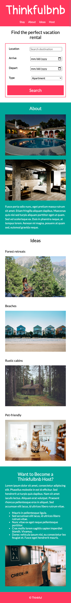

# Thinkfulbnb

Thinkfulbnb is a vacation rental website that allows people to rent out their homes to people who are seeking short-term accommodations in that locale. Thinkfulbnb hosts rent out different kinds of properties, including single rooms, apartments, and unique living spaces such as yachts, houseboats, yurts, tiny houses, and even renovated medieval castles.

For this assignment, you will implement Thinkfulbnb's landing page in HTML & CSS.

### Mobile view

### Desktop view

### This application is a BnB servise that looks for houses and apartments for short term rent using data that a user inputs to find the perfect place for the user to relax and stay at

### tech stack used was HTML and CSS
